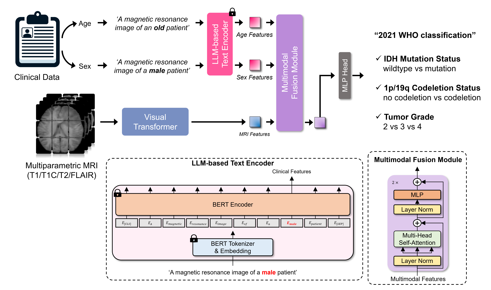

# GlioMT




This repo is the official implementation of ***"An Interpretable Multimodal Transformer for Prediction of Molecular Subtypes and Grades in Adult-type Diffuse Gliomas"***.

Yunsu Byeon*, Yae Won Park*, Soohyun Lee, HyungSeob Shin, Doohyun Park, Sung Soo Ahn, Kyunghwa Han, Jong Hee Chang, Se Hoon Kim, Seung-Koo Lee, Dosik Hwang


## Updates

***28/08/2024***

Initial commits

## Abstract
Molecular subtyping and grading of adult-type diffuse gliomas are essential for treatment decisions and patient prognosis. Here, we introduce a robust interpretable multimodal transformer (GlioMT), incorporating imaging and clinical data, to predict the molecular subtype and grade of adult-type diffuse gliomas according to the 2021 WHO classification. GlioMT is trained on multiparametric MRI data from an institutional set of 1,053 patients with adult-type diffuse gliomas (144 oligodendrogliomas, 157 IDH-mutant astrocytomas, and 752 IDH-wildtype glioblastomas) to predict the IDH mutation status, 1p/19q codeletion status, and tumor grade. External validation is performed on 200 and 477 patients from the TCGA and UCSF sets, respectively. GlioMT outperforms conventional CNNs and visual transformers across multiple classification tasks with the highest AUCs for prediction of IDH mutation (0.92 on TCGA and 0.98 on UCSF), 1p/19q codeletion (0.85 on TCGA and 0.81 on UCSF), and grade (0.81 on TCGA and 0.91 on UCSF). Interpretability analysis revealed that GlioMT effectively highlighted tumor regions that are considered most discriminative, underscoring its potential to improve the reliability of clinical decision-making. 
 


## Model Weights

|                   | CNN | Visual Transformer | GlioMT |
|:-----------------:|:------------------------:|:---------------------------------------:|:---------------------------:|
| IDH mutation      |       [VGG-19](https://drive.google.com/file/d/1S-MZGCPEh4pn7ZBWA5j3Gb20kOdpQfwW/view?usp=drive_link)       |               [ViT-B](https://drive.google.com/file/d/1Gd4M52A5YI1YAbRc0PHlFdnDZHbJUQPc/view?usp=drive_link)           |       [GlioMT_ViT-B](https://drive.google.com/file/d/1VtRU3W_Tl_ghrsa2Fjpmr8Y-yJqaV_sn/view?usp=drive_link)    |
| 1p/19q codeletion |    [DenseNet-121](https://drive.google.com/file/d/1iK2z0NrYDRMuiKJBaCbC3RVDGZpisWNT/view?usp=drive_link)    |               [Swin-S](https://drive.google.com/file/d/1H5VvbwVSPr-zsEJYeD_3VuL3nmdEOoMh/view?usp=drive_link)          |      [GlioMT_Swin-S](https://drive.google.com/file/d/1AkXwnEBg_M0f7eaF11TuSyqu6ktDCuPb/view?usp=drive_link)    |
| Tumor Grade       |      [ResNet-50](https://drive.google.com/file/d/1YT0ggGdCes8MQiwxLCGKcbRxp_24bqdh/view?usp=drive_link)     |               [Swin-S](https://drive.google.com/file/d/1WdVsL1psAeVx0arMztKPwa1PNsH0I7b2/view?usp=drive_link)          |      [GlioMT_Swin-S](https://drive.google.com/file/d/1lnasGRbYbA5c3cPmZa0kBwJkixCrV9Sj/view?usp=drive_link)    |


## Installation
Please check [INSTALL.md](INSTALL.md) for installation instructions.

## Data Preparation
Datasets must be located in the `data` folder. Within each dataset folder, the following structure is expected:

```
./data/Internal_set/
├── subject001
│   ├── subject001_T1.nii.gz
│   ├── subject001_T1C.nii.gz
│   ├── subject001_T2.nii.gz
│   ├── subject001_FLAIR.nii.gz
│
├── subject002
│   ├── subject002_T1.nii.gz
│   ├── subject002_T1C.nii.gz
│   ├── subject002_T2.nii.gz
│   ├── subject002_FLAIR.nii.gz
│
│ ...
```
The label file (`.xlsx`) must be located outside the dataset folder, an example is as follows:
```
./data/
├── Internal_set
├── Internal_set_label.xlsx
├── TCGA
├── TCGA_label.xlsx
├── UCSF
├── UCSF_label.xlsx
│...
```

### Modify the paths of configs
When adding your dataset in `data` folder, you should modify the `.yaml` file in `configs/paths`.

Example for `configs/paths/train.yaml`:
```
defaults:
  - default

#DATA
data_root: /home/user/GlioMT/data/Internal_set/
label_root: /home/user/GlioMT/data/Internal_set.xlsx

task_name: "train"

```

### Label Structure
To use the code directly, create and use a label file in the format `./data/label_sample.xlsx`.


## Training

**CNN & Visual Transformer Models**
```
# Usage
# bash ./scripts/run_train.sh {loss} {metric} {model} {cls_mode} {num_classes} {slice percentile}


# IDH mutation
bash ./scripts/run_train.sh bce binary resnet50 idh 1 75

# 1p/19q codeletion
bash ./scripts/run_train.sh bce binary vit_base 1p_19q 1 75

# CNS WHO Grade
bash ./scripts/run_train.sh ce multiclass resnet50 grade 3 25
```

**GlioMT**
```
# Usage
# bash ./scripts/run_train_GlioMT.sh {loss} {metric} {model} {cls_mode} {num_classes} {slice percentile}


# IDH mutation
bash ./scripts/run_train_GlioMT.sh bce binary GlioMT_vit_base idh 1 75

# 1p/19q codeletion
bash ./scripts/run_train_GlioMT.sh bce binary GlioMT_swin_small 1p_19q 1 75

# CNS WHO Grade
bash ./scripts/run_train_GlioMT.sh ce multiclass GlioMT_vit_base grade 3 25
```

Our code's argument modification is based on [Hydra](https://hydra.cc/). To customize each argument to suit the user, modifications can be made in the `configs` folder.


## Inference
**CNN & Visual Transformer Models**
```
# Usage
# bash ./scripts/run_eval.sh {metric} {model} {cls_mode} {num_classes} {slice percentile} {checkpoint_path}


# IDH mutation
bash ./scripts/run_eval.sh binary GlioMT_vit_base idh 1 75 ./exp/runs/idh/20240101/090000/
```

**GlioMT**
```
# Usage
# bash ./scripts/run_eval_GlioMT.sh {metric} {model} {cls_mode} {num_classes} {slice percentile} {checkpoint_path}


# IDH mutation
bash ./scripts/run_eval_GlioMT.sh binary GlioMT_vit_base idh 1 75 ./exp/runs/idh/20240101/090000/
```
