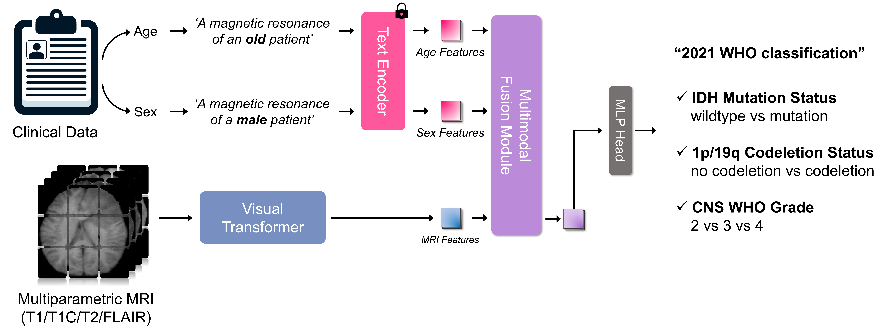

# An Interpretable Multimodal Transformer for Prediction of Molecular Subtypes and Grades in Adult-type Diffuse Gliomas According to the 2021 WHO Classification




Official PyTorch codebase of Multimodal Transformer, a method for molecular subtyping and grading in adult-type diffuse gliomas according to the 2021 WHO classification.

Yunsu Byeon*, Yae Won Park*, Soohyun Lee, HyungSeob Shin, Doohyun Park, Sung Soo Ahn, Kyunghwa Han, Jong Hee Chang, Se Hoon Kim, Seung-Koo Lee, Dosik Hwang


Please cite this paper when you use this code.

## Installation
Please check [INSTALL.md](INSTALL.md) for installation instructions.

## Training

### CNN & Visual Transformer Models
```
# IDH mutation
python train.py loss=bce metric=binary model=resnet50 cls_mode=idh model.num_classes=1

# 1p/19q codeletion
python train.py loss=bce metric=binary model=resnet50 cls_mode=1p_19q model.num_classes=1

# CNS WHO Grade
python train.py loss=ce metric=multiclass model=resnet50 cls_mode=grade model.num_classes=3
```

### Our Multimodal Transformer Models
```
# IDH mutation
python train_multimodal.py loss=bce metric=binary model=multimodal_swin_small cls_mode=idh model.num_classes=1

# IDH mutation
python train_multimodal.py loss=bce metric=binary model=multimodal_swin_small cls_mode=1p_19q model.num_classes=1

# IDH mutation
python train_multimodal.py loss=ce metric=multiclass model=multimodal_swin_small cls_mode=idh model.num_classes=3
```


Create a new virtual environment and install all dependencies by:
### 1. Install Pytorch
you should install pytorch ( cuda version of pytorch should be smaller than nvidia-smi cuda version )
### 2. Install Requirements
```
pip install -r requirement.txt
```

 


 


## Preprocessing & Data Analysis

###  1. Skull-Stripping
Reference : [HD-BET](https://github.com/MIC-DKFZ/HD-BET)

```
python /mai_nas/BYS/brain_metastasis/analysis/hd_bet_shell.py
```
* 애초에 T1C 가 Registration Reference 시퀀스이고, resolution이 가장 좋고, 짤림이 없는 영상이기 때문에 T1C 영상으로 HD-BET을 한다.


### 2. Refine Bet Results & Nonzero crop
```
python /mai_nas/BYS/brain_metastasis/analysis/hd_bet_refine.py

```
* T1C HD_BET mask 를 이용해서 T1, T2, FLAIR 도 skull-stripping 진행한다.
* Non-zero crop을 해준다
* T1C Bet 결과의 이름을 바꿔준다.
* ver1, ver2 선택하기

**img size 확인**
```
python /mai_nas/BYS/brain_metastasis/analysis/img_size_analysis.py

```

### 3. Generate Segmentation Mask (nnUNet)
**1) Export 경로 설정**
```
export nnUNet_raw_data_base="/mai_nas/BYS/brain_metastasis/nnunet/nnUNet_raw_data_base/" 
export nnUNet_preprocessed="/mai_nas/BYS/brain_metastasis/nnunet/nnUNet_preprocessed/" 
export RESULTS_FOLDER="/mai_nas/BYS/brain_metastasis/nnunet/nnUNet_trained_models/"
```

**2) 데이터 conversion**
```
python /mai_nas/BYS/brain_metastasis/Task082_BraTS2020.py
```

**3) Inference**
```
OMP_NUM_THREADS=1 CUDA_VISIBLE_DEVICES=4 nnUNet_predict -i /mai_nas/BYS/brain_metastasis/nnunet/nnUNet_raw_data_base/Task082_BraTS2020/imagesTs -o /mai_nas/BYS/brain_metastasis/nnunet/nnunet_results -m 3d_fullres -t Task082_BraTS2020 --save_npz
```

**4) Quality Check**
```
python /mai_nas/BYS/brain_metastasis/analysis/quality_check.py
```
* glioma 영역이 가장 큰 axial slice 하나를 뽑아서 contrast 별로 출력하는 코드

* glioma subtype 별로 어떻게 다른지 공부하기**


### 4. Data Conversion
```
python /mai_nas/BYS/brain_metastasis/data_conversion.py
```

* task 는 현재 'SEV' 로 지정해서 하고 있음


## Training

### 1. Run training

먼저, ./config 안에 있는 config 파일을 설정해야한다.
그 다음 아래 코드를 실행한다.

**2D**
```
python main.py --model [model] --cls_mode [class mode] --num_slice_per_patient [# slice] --gpus [gpus] --dimension 2d --batch_size [batch size]
```

**3D**
```
python main.py --model [model] --cls_mode [class mode] --gpus [gpus] --dimension 3d --batch_size [batch size]
```

- cls_mode : 'idh', '1p_19q' 같이 원하는 모드 선택
- num_slice_per_patient : 2D 에서만 사용하고, max_roi_slice 중심으로 몇개의 slice 를 train/val 로 사용할지 
- model : resnet50 같은 모델명 설정
- tumor_crop : argument에 있는데, tumor_crop을 사
나머지 lr 이나 loss function 선택은 모두 config 파일에서 설정


### 2. Run inference
**2D**
```
python inference.py --cmd [cmd mode] --model [model] --cls_mode [class mode] --num_slice_per_patient [# slice] --gpus [gpus] --dimension 2d --resume [.pth 파일 경로]
```

**3D**
```
python inference.py --cmd [cmd mode] --model [model] --cls_mode [class mode] --gpus [gpus] --resume [.pth 파일 경로] --dimension 3d 
```

- cmd : Internal validation set을 할 거라면 'val' 선택 ,  External validation (TCGA) dataset 할 거라면 'test' 선택
- cls_mode : 'idh', '1p_19q' 같이 원하는 모드 선택
- num_slice_per_patient : max_roi_slice 중심으로 몇개의 slice 를 train/val 로 사용할지
- model : resnet50 같은 모델명 설정


### 3. Docker Script
**2D**
```
bash docker_build.sh

docker run -it --gpus all --privileged --net=host --pid=host --ipc=host -v /mai_nas/BYS/brain_metastasis:/mai_nas/BYS/brain_metastasis --name glioma d9e /bin/bash
```

**3D**
```
python inference.py --cmd [cmd mode] --model [model] --cls_mode [class mode] --gpus [gpus] --resume [.pth 파일 경로] --dimension 3d 
```

- cmd : Internal validation set을 할 거라면 'val' 선택 ,  External validation (TCGA) dataset 할 거라면 'test' 선택
- cls_mode : 'idh', '1p_19q' 같이 원하는 모드 선택
- num_slice_per_patient : max_roi_slice 중심으로 몇개의 slice 를 train/val 로 사용할지
- model : resnet50 같은 모델명 설정